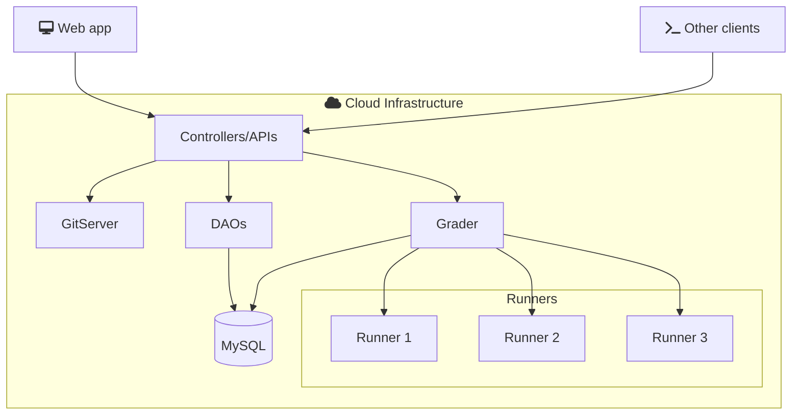

# Architecture Overview

omegaUp has been designed with the [MVC model](https://en.wikipedia.org/wiki/Model%E2%80%93view%E2%80%93controller) to separate concerns and maintain a clean, scalable architecture.

## MVC Model

The Model-View-Controller (MVC) is a software design pattern that separates an application into three main logical components: the model, the view, and the controller. Each of these components is built to handle specific development aspects of an application.

- **Model**: Represents the data and the business logic of the application. It directly manages the data, logic, and rules of the application.
- **View**: Represents the UI (User Interface) of the application. It displays the data from the model to the user and sends user commands to the controller.
- **Controller**: Acts as an intermediary between the model and the view. It listens to the input from the view, processes it (possibly altering the model), and returns the display output to the view.

## System Flowchart

The following diagram shows how the different components of omegaUp interact:

## Request Flow

When a user makes a submission:

1. **Web App/CLI** sends an HTTP POST request to the API endpoint (e.g., `/api/run/create/`)
2. **Controllers** validate the request, authenticate the user, and process business logic
3. **DAOs** (Data Access Objects) interact with the MySQL database to persist data
4. **Controllers** notify the Grader to process the submission
5. **Grader** manages the queue and dispatches to available Runners
6. **Runners** compile and execute the code against test cases
7. **Grader** validates outputs and calculates the final score
8. **Broadcaster** updates scoreboards and notifies users in real-time

## Technology Stack

The list of technologies used to build omegaUp:

| Technology          | Purpose                | Version  |
| ------------------- | ---------------------- | -------- |
| MySQL            | Database             | 8.0.34 |
| PHP              | Controllers        | 8.1.2   |
| Python           | Cronjobs             | 3.10.12 |
| TypeScript       | Frontend             | 4.4.4  |
| Vue.js            | Frontend             | 2.5.22 |
| Bootstrap 4       | Frontend             | 4.5.0 |
| Go               | Grader               | 20.0.1 |

Versions are periodically updated to keep the platform supported by all languages.

## Code Organization

- **Frontend**: Located in `frontend/`, contains the TypeScript/Vue.js web application
- **Controllers**: PHP files in `frontend/server/src/Controllers/` handle API endpoints
- **DAOs**: Data access layer in `frontend/server/src/DAO/` manages database operations
- **Grader**: Go-based grading system that manages submission evaluation
- **Runners**: Isolated execution environments for running user code
