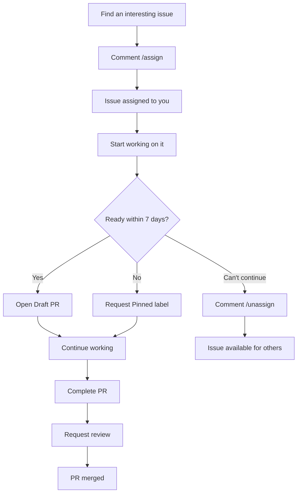

This repository uses the [`takanome-dev/assign-issue-action`](https://github.com/takanome-dev/assign-issue-action) to keep issue assignments fair and active.

## Commands

You can use the following commands in issue comments:

- `/assign`: Self-assign the issue to yourself
- `/unassign`: Remove yourself from the issue

<Info>
The bot may auto-suggest assignment if you comment showing interest in an issue.
</Info>

## Limits and Deadlines

### Assignment Limits

**Maximum concurrent assignments per contributor: 3**

You can have up to 3 active issue assignments at any given time. This limit ensures fair distribution of work among contributors and prevents hoarding of issues.

### 7-Day PR Requirement

<Warning>
You must open a PR (draft is fine) within **7 days** of assignment.
</Warning>

Once an issue is assigned to you:

1. A **7-day timer** starts
2. A reminder is posted roughly halfway (~3.5 days) before auto-unassignment
3. If no PR is opened by day 7, you are **automatically unassigned**
4. After auto-unassignment, you are **blocked from self-reassigning** the issue
5. If you still want to work on it, ask a maintainer to reassign it to you

<Note>
Opening a **Draft PR** is acceptable and satisfies the 7-day requirement. This allows you to show progress while continuing to work on the issue.
</Note>

## Experienced Issue Creators

Contributors who create an issue and have at least **10 merged PRs** receive special privileges:

- May self-assign issues they created **without any assignment limit**
- The existing **7-day inactivity auto-unassign rule** still applies
- When assigning themselves to issues created by others, the standard maximum of **3 active assignments** still applies

<Info>
This exception recognizes experienced contributors who are creating and solving issues from their own work.
</Info>

## Tips for New Contributors

<Steps>
  <Step title="Self-assign the issue">
    Comment `/assign` on the issue you want to work on.
  </Step>
  
  <Step title="Open a PR within 7 days">
    Open a PR (draft is OK) within **7 days** to keep the assignment slot.
    
    This shows activity and prevents automatic unassignment.
  </Step>
  
  <Step title="Unassign if you can't continue">
    If you can't continue working on the issue, use `/unassign` so others can pick it up.
    
    This helps maintain a healthy contribution ecosystem.
  </Step>
  
  <Step title="Request more time if needed">
    If you need more time beyond 7 days, ask a maintainer to add the `📌 Pinned` label.
    
    This will prevent automatic unassignment.
  </Step>
</Steps>

## Workflow Example

Here's a typical workflow for working on an issue:

## Frequently Asked Questions

<AccordionGroup>
  <Accordion title="What happens if I miss the 7-day deadline?">
    If you don't open a PR (or draft PR) within 7 days:
    - You will be automatically unassigned from the issue
    - You will be blocked from self-reassigning the same issue
    - You'll need to ask a maintainer if you want to continue working on it
    
    To avoid this, open a draft PR even if your work is incomplete.
  </Accordion>
  
  <Accordion title="Can I have more than 3 assignments?">
    Generally, no. The limit is 3 active assignments per contributor.
    
    The only exception is for experienced contributors (10+ merged PRs) who create their own issues - they can self-assign their own issues without limit.
  </Accordion>
  
  <Accordion title="What counts as a PR for the 7-day requirement?">
    Both draft PRs and regular PRs count. Opening a draft PR is a great way to:
    - Show you're actively working on the issue
    - Get early feedback on your approach
    - Satisfy the 7-day requirement while continuing to work
  </Accordion>
  
  <Accordion title="How do I get more time to work on an issue?">
    If you need more than 7 days:
    1. Comment on the issue explaining why you need more time
    2. Ask a maintainer to add the `📌 Pinned` label
    3. This will prevent automatic unassignment
    
    Alternatively, just open a draft PR to show progress.
  </Accordion>
  
  <Accordion title="What if I want to work on an issue someone else abandoned?">
    If an issue has been auto-unassigned or the previous assignee used `/unassign`, you can:
    1. Comment `/assign` to assign it to yourself
    2. Start working on it following the normal workflow
  </Accordion>
</AccordionGroup>

## Related Pages

- [Contributing Guidelines](/development/contributing)
- [How to Make a Pull Request](/development/pull-requests)
- [Coding Guidelines](/development/coding-guidelines)