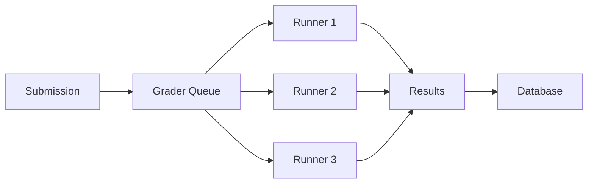

## Overview

omegaUp provides a comprehensive suite of features designed for students, educators, and competitive programmers. From problem-solving and contests to badges and analytics, the platform offers everything you need for programming education and competition.

## Core features

<CardGroup cols={2}>
  <Card title="Extensive problem library" icon="book">
    Access thousands of programming challenges across all difficulty levels and topics.
  </Card>
  <Card title="Contest management" icon="trophy">
    Create and participate in competitive programming contests with flexible configurations.
  </Card>
  <Card title="Multi-language support" icon="globe">
    Write solutions in C, C++, Java, Python, JavaScript, Ruby, and more.
  </Card>
  <Card title="Real-time grading" icon="bolt">
    Instant feedback on submissions with detailed test case results.
  </Card>
  <Card title="Interactive problems" icon="comments">
    Support for interactive challenges using libinteractive.
  </Card>
  <Card title="Karel integration" icon="robot">
    Educational robot programming with karel.js for beginners.
  </Card>
  <Card title="Badges & achievements" icon="medal">
    Earn recognition for solving problems and maintaining streaks.
  </Card>
  <Card title="REST API" icon="code">
    Full API access for building custom tools and integrations.
  </Card>
  <Card title="Course management" icon="chalkboard-user">
    Create structured learning paths with assignments and grading.
  </Card>
  <Card title="Quality assurance" icon="certificate">
    Community-reviewed problems with quality seals and ratings.
  </Card>
</CardGroup>

## 1. Problem library and discovery

omegaUp hosts a vast collection of competitive programming problems with powerful search and filtering capabilities.

### Problem organization

- **Difficulty levels**: Problems are rated from easy to expert
- **Topic tags**: Filter by algorithms, data structures, math, graphs, and more
- **Quality ratings**: Community-driven quality scores and histograms
- **Difficulty ratings**: Statistically-derived difficulty metrics
- **Language support**: See which programming languages each problem accepts

### Problem statistics

Each problem displays comprehensive statistics:

```json
{
  "accepted": 1247,
  "submissions": 3891,
  "ratio": 0.32,
  "quality": 4.2,
  "difficulty": 2.8,
  "points": 100,
  "visits": 15432
}
```

<Tip>
  Use the **quality seal** indicator to find well-crafted problems that have been reviewed and approved by the community.
</Tip>

### Search and filtering

Find problems using:
- Keyword search in titles and descriptions
- Tag-based filtering (single or multiple tags)
- Difficulty range selection
- Quality threshold filtering
- Sorting by various metrics (difficulty, quality, submissions, ratio, points)

## 2. Contest system

Create and manage competitive programming contests with extensive customization options.

### Contest types

<AccordionGroup>
  <Accordion title="Public contests">
    Open to all users. Anyone can register and participate. Great for community events and practice competitions.
  </Accordion>

  <Accordion title="Private contests">
    Invitation-only contests. Perfect for classroom assignments, team selection, or private training sessions.
  </Accordion>

  <Accordion title="Registration-based contests">
    Public contests requiring user registration. Useful for tracking participants while keeping the contest accessible.
  </Accordion>

  <Accordion title="Window-length contests (USACO-style)">
    Each participant gets a fixed time window that starts when they first open the contest. The `start_time` determines when users can begin, and `window_length` sets the contest duration per user.
  </Accordion>
</AccordionGroup>

### Contest configuration

Fine-tune your contest with these settings:

| Setting | Description |
| ------- | ----------- |
| **Scoreboard percentage** | Control scoreboard visibility (0-100%). After this threshold, participants see frozen scoreboards |
| **Points decay factor** | Enable time-based scoring where late submissions receive fewer points |
| **Partial score** | Allow partial credit for test cases instead of all-or-nothing scoring |
| **Submission gap** | Minimum seconds between submissions to prevent spam |
| **Penalty policy** | Choose how penalties are calculated: from contest start, problem open, or none |
| **Feedback mode** | Control verdict visibility: full (`yes`), none (`no`), or limited (`partial`) |

<Warning>
  In contests with frozen scoreboards, participants cannot see the final standings until the scoreboard is unfrozen by administrators.
</Warning>

### Contest features

- **Clarifications**: Two-way communication system between participants and organizers
- **Problem ordering**: Customize problem display order and assign letter identifiers
- **Window length**: Individual time windows for each contestant
- **Submission deadline**: Enforce cutoff times for late submissions
- **Admin panel**: Real-time contest monitoring and management

## 3. Automated grading system

The grading infrastructure evaluates code submissions securely and efficiently.

### Grader architecture

The system consists of:

1. **Grader service**: Manages the submission queue and distributes work
2. **Runners**: Isolated execution environments for running code
3. **Sandbox**: Linux containers with minijail for secure code execution
4. **Database**: MySQL storage for results and metadata



### Execution limits

Problems enforce resource constraints:

```php
$limits = [
    'TimeLimit' => '1000',        // milliseconds
    'MemoryLimit' => 67108864,    // bytes (64 MB)
    'OutputLimit' => 10240,       // bytes (10 KB)
    'OverallWallTimeLimit' => '5000', // milliseconds
    'ExtraWallTime' => '0'        // extra time buffer
];
```

### Verdict types

| Verdict | Code | Description |
| ------- | ---- | ----------- |
| Accepted | AC | Solution correct on all test cases |
| Wrong Answer | WA | Incorrect output |
| Time Limit Exceeded | TLE | Execution time exceeded limit |
| Memory Limit Exceeded | MLE | Memory usage exceeded limit |
| Runtime Error | RE | Program crashed or returned non-zero |
| Compilation Error | CE | Code failed to compile |
| Judging | JE | Currently being evaluated |

<Note>
  The grader uses [quark](https://github.com/omegaup/quark), omegaUp's custom grading system, and [omegajail](https://github.com/omegaup/omegajail) for secure sandboxing based on Linux containers and seccomp-bpf.
</Note>

## 4. Problem creation tools

Create problems using visual tools or manual ZIP file generation.

### Problem Creator (CDP)

The visual [Problem Creator](https://omegaup.com/problem/creator) provides:

- **Visual interface**: No command-line required
- **Markdown editor**: Write problem statements with formatting
- **Test case management**: Define inputs, outputs, and point values
- **Group organization**: Organize test cases into logical groups
- **Solution templates**: Provide starter code for contestants

```json
{
  "problemName": "Sum of Numbers",
  "problemMarkdown": "Calculate the sum of N integers...",
  "casesStore": {
    "groups": [
      {
        "groupID": "group1",
        "name": "Sample Cases",
        "points": 30,
        "cases": [
          {
            "caseID": "case1",
            "lines": [...],
            "output": "15",
            "points": 10
          }
        ]
      }
    ]
  }
}
```

### Manual ZIP creation

For advanced use cases, create problems by uploading ZIP files containing:

- **cases/**: Test case input/output files
- **statements/**: Problem statements in multiple languages (Markdown)
- **solutions/**: Reference solutions
- **settings.json**: Problem configuration
- **validator**: Custom validation logic (optional)

<Tip>
  Use the manual ZIP method for Karel problems, interactive problems, or when you need fine-grained control over validation logic.
</Tip>

## 5. Badge and achievement system

Earn recognition for your accomplishments on the platform.

### Available badges

<CardGroup cols={2}>
  <Card title="100 Solved Problems" icon="hundred-points">
    Complete 100 accepted solutions across all problems.
  </Card>
  <Card title="7/15/30 Day Streak" icon="fire">
    Solve at least one problem daily for consecutive days.
  </Card>
  <Card title="500+ Score" icon="star">
    Achieve a cumulative score of 500 or higher.
  </Card>
  <Card title="Coder of the Month" icon="crown">
    Earn the most points in a calendar month.
  </Card>
  <Card title="Contest Manager" icon="users">
    Successfully organize and run a contest.
  </Card>
  <Card title="Feedback Provider" icon="comments">
    Contribute helpful problem reviews and feedback.
  </Card>
  <Card title="C++ Expert" icon="code">
    Demonstrate mastery of C++ by solving advanced problems.
  </Card>
  <Card title="C++ Course Graduate" icon="graduation-cap">
    Complete the C++ programming course.
  </Card>
</CardGroup>

### Badge metadata

Each badge includes:

```json
{
  "title": "7 Day Streak",
  "description": "Solved problems for 7 consecutive days",
  "icon": "default_icon.svg",
  "localizations": {
    "en": "7 Day Streak",
    "es": "Racha de 7 días"
  }
}
```

## 6. REST API

Access omegaUp programmatically with a comprehensive REST API.

### API structure

All endpoints use the base URL: `https://omegaup.com/api/`

<CodeGroup>
```bash Get server time
curl https://omegaup.com/api/time/get/
```

```bash Login
curl -X POST https://omegaup.com/api/user/login \
  -d '{"usernameOrEmail": "user", "password": "pass"}'
```

```bash List contests
curl https://omegaup.com/api/contest/list/ \
  -H "Cookie: ouat=YOUR_AUTH_TOKEN"
```
</CodeGroup>

### Authentication

1. Call `/api/user/login` with credentials
2. Receive an `auth_token` in the response
3. Include token in cookie `ouat` for subsequent requests

<Warning>
  omegaUp supports only **one active session** at a time. Logging in programmatically will invalidate your browser session.
</Warning>

### API categories

- **User API**: Authentication, profile management, rankings
- **Problem API**: Browse problems, submit solutions, view results
- **Contest API**: List contests, register, view standings
- **Run API**: Submission history, verdict details, source code
- **Clarification API**: Ask and answer questions during contests

### Response format

```json
{
  "status": "ok",
  "time": 1436577101
}
```

Errors return:

```json
{
  "status": "error",
  "error": "Invalid credentials",
  "errorcode": 401,
  "errorname": "AUTHENTICATION_FAILED"
}
```

## 7. Interactive problems

Support for problems where your code interacts with a judge program.

### Using libinteractive

The [libinteractive](https://github.com/omegaup/libinteractive) library enables:

- **Query-response protocols**: Your code asks questions, judge responds
- **Multi-round interactions**: Multiple communication rounds
- **Language interoperability**: Interface between different languages
- **Automatic interface generation**: IDL-based code generation

### Interactive problem structure

```json
{
  "interactive": {
    "module_name": "interactive",
    "idl": "interface.idl",
    "main_source": "Main.cpp",
    "templates": {
      "cpp": "template.cpp",
      "py": "template.py"
    }
  }
}
```

<Tip>
  Remember to flush output after each response in interactive problems, or communication may hang.
</Tip>

## 8. Karel the Robot

omegaUp integrates [karel.js](https://github.com/omegaup/karel.js), the official Karel implementation used by the Mexican Informatics Olympiad.

### Karel features

- Visual grid-based programming environment
- Block-based code editor for beginners
- Text-based Karel language for advanced users
- Real-time execution visualization
- Educational focus on programming fundamentals

### Karel commands

Basic Karel instructions:
- `avanza()` - Move forward one square
- `gira_izquierda()` - Turn left 90 degrees
- `coge_zumbador()` - Pick up a beeper
- `deja_zumbador()` - Drop a beeper

## 9. Course management

Create structured learning experiences with assignments and progress tracking.

### Course features

- **Assignments**: Organize problems into homework sets
- **Deadlines**: Enforce submission cutoffs
- **Student progress**: Track completion and scores
- **Gradebook**: Automated grading and reporting
- **Private problems**: Course-exclusive challenges

## 10. Analytics and monitoring

Comprehensive statistics for problems, contests, and users.

### Problem statistics

```json
{
  "verdict_counts": {
    "AC": 1247,
    "WA": 1891,
    "TLE": 523,
    "MLE": 87,
    "RE": 143
  },
  "total_runs": 3891,
  "pending_runs": ["guid1", "guid2"],
  "distribution": {
    "0-20": 145,
    "20-40": 289,
    "40-60": 412,
    "60-80": 651,
    "80-100": 1247
  }
}
```

### Available metrics

- Submission trends over time
- Language distribution
- Runtime and memory usage patterns
- User activity and engagement
- Contest participation rates

<Card title="Explore more" icon="book-open">
  Visit the [GitHub documentation](https://github.com/omegaup/omegaup/tree/main/frontend/www/docs) for detailed guides on advanced features, API reference, and development workflows.
</Card>