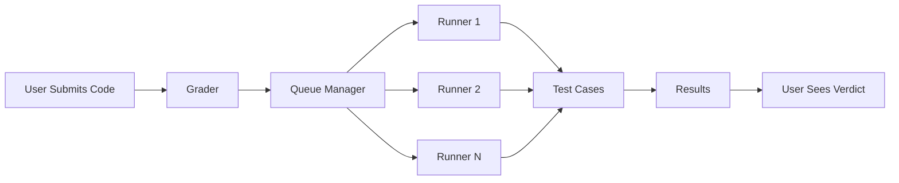

## Overview

omegaUp's grading system automatically evaluates submitted code by running it against predefined test cases in a secure, isolated environment. The system uses a distributed architecture with multiple runners executing code in sandboxed containers.

## Architecture

The grading system consists of three main components:



<CardGroup cols={3}>
  <Card title="Grader" icon="server">
    Receives submissions and manages the grading queue
  </Card>
  <Card title="Queue manager" icon="list">
    Routes submissions to available runners based on priority
  </Card>
  <Card title="Runners" icon="computer">
    Execute code in secure sandboxes and return results
  </Card>
</CardGroup>

## Submission flow

<Steps>
  <Step title="Code submission">
    User submits solution through the arena or API
    
    ```json
    {
      "problem_alias": "sum",
      "language": "cpp17-gcc",
      "source": "#include <iostream>\nusing namespace std;\n..."
    }
    ```
  </Step>
  
  <Step title="Queue assignment">
    Grader assigns submission to appropriate queue based on:
    - Contest priority (active contests get priority)
    - User priority (admins > regular users)
    - Problem type (local vs external judge)
  </Step>
  
  <Step title="Runner selection">
    Queue manager sends submission to available runner
  </Step>
  
  <Step title="Code compilation">
    Runner compiles the code (if applicable) with language-specific flags
  </Step>
  
  <Step title="Test case execution">
    Runner executes code against each test case in a sandboxed environment
  </Step>
  
  <Step title="Results aggregation">
    Runner collects results (verdict, runtime, memory) for each test case
  </Step>
  
  <Step title="Score calculation">
    Grader calculates final score based on test case results and problem settings
  </Step>
  
  <Step title="Notification">
    User receives verdict and detailed results
  </Step>
</Steps>

## Queue system

omegaUp uses an eight-queue priority system:

### Queue priorities

1. **High-priority contest** - Active ICPC-style contests
2. **Normal priority contest** - Regular contests
3. **Low-priority contest** - Practice contests
4. **Ephemeral** - Quick evaluation (API calls)
5. **Normal** - Regular problem submissions
6. **Low** - Rejudge requests
7. **Retry** - Failed submissions being retried
8. **Broadcast** - Mass rejudge operations

<Info>
  Contest submissions always have higher priority than practice submissions to ensure fair competition.
</Info>

## Sandbox security

All code executes inside secure sandboxes using minijail and Linux containers:

### Security measures

<AccordionGroup>
  <Accordion title="Filesystem isolation">
    Programs run in isolated filesystems with read-only access to system files. Cannot access other users' data or system files.
  </Accordion>

  <Accordion title="Network blocking">
    All network access is blocked. Programs cannot make external connections or communicate with other processes.
  </Accordion>

  <Accordion title="System call filtering">
    Only whitelisted system calls are allowed using seccomp-bpf. Attempts to use restricted calls result in immediate termination.
  </Accordion>

  <Accordion title="Resource limits">
    Strict CPU time, memory, and process limits prevent resource exhaustion attacks.
  </Accordion>

  <Accordion title="User isolation">
    Each submission runs as an unprivileged user with no access to host system resources.
  </Accordion>
</AccordionGroup>

### Resource limits

Default limits per submission:

```php
// From Problem.php
const DEFAULT_TIME_LIMIT = 1.0; // seconds
const DEFAULT_MEMORY_LIMIT = 67108864; // 64 MB in bytes
const DEFAULT_OUTPUT_LIMIT = 10485760; // 10 MB
const DEFAULT_STACK_LIMIT = 10485760; // 10 MB
```

<ParamField path="time_limit" type="number" default="1.0">
  Maximum execution time in seconds (multiplied by language factor)
</ParamField>

<ParamField path="memory_limit" type="number" default="67108864">
  Maximum memory usage in bytes
</ParamField>

<ParamField path="output_limit" type="number" default="10485760">
  Maximum output size in bytes
</ParamField>

## Test case evaluation

### Test case types

<Tabs>
  <Tab title="Standard test cases">
    Program reads from standard input and writes to standard output. Output is compared with expected output.
    
    ```bash
    # Input file: cases/0.in
    5 3
    
    # Expected output: cases/0.out
    8
    ```
  </Tab>

  <Tab title="Custom validator">
    A custom program validates the output, allowing for multiple correct answers or special validation logic.
    
    ```cpp
    // validator.cpp
    #include "validator.h"
    
    int main() {
        string userOutput = readOutput();
        string contestantOutput = readContestantOutput();
        
        if (isValidSolution(contestantOutput)) {
            return 0; // Accept
        }
        return 1; // Wrong Answer
    }
    ```
  </Tab>

  <Tab title="Interactive">
    Program interacts with a judge through stdin/stdout using libinteractive protocol.
    
    ```cpp
    // Interactive guessing game
    int main() {
        int low = 1, high = 100;
        while (low < high) {
            int mid = (low + high) / 2;
            cout << mid << endl;
            string response;
            cin >> response;
            if (response == "correct") return 0;
            else if (response == "higher") low = mid + 1;
            else high = mid - 1;
        }
    }
    ```
  </Tab>
</Tabs>

### Scoring methods

<AccordionGroup>
  <Accordion title="All-or-nothing">
    Problem is worth full points only if all test cases pass. One failed test case = 0 points.
  </Accordion>

  <Accordion title="Partial scoring">
    Points are awarded for each passed test case. Total score is the sum of individual test case points.
    
    ```
    Test case 1: 20 points ✓
    Test case 2: 30 points ✗
    Test case 3: 50 points ✓
    
    Total: 70 / 100 points
    ```
  </Accordion>

  <Accordion title="Group scoring">
    Test cases are grouped. All cases in a group must pass to earn the group's points.
    
    ```
    Group 1 (30 points): Cases 1-5 all pass ✓ → 30 points
    Group 2 (40 points): Case 7 fails ✗ → 0 points
    Group 3 (30 points): Cases 11-15 all pass ✓ → 30 points
    
    Total: 60 / 100 points
    ```
  </Accordion>

  <Accordion title="Min scoring">
    Score is the minimum score across all test groups.
  </Accordion>
</AccordionGroup>

## Compilation process

### Compilation flags

Different languages use optimized compilation flags:

<Tabs>
  <Tab title="C++">
    ```bash
    g++ -std=c++17 -O2 -Wall -Wextra \
        -Wshadow -Wconversion -Wfloat-equal \
        -o program source.cpp
    ```
  </Tab>

  <Tab title="Java">
    ```bash
    javac -encoding UTF-8 Main.java
    java -Xmx512m -Xss64m Main
    ```
  </Tab>

  <Tab title="Python">
    ```bash
    python3 -B -O source.py
    ```
    
    No compilation needed; runs directly with optimizations enabled.
  </Tab>
</Tabs>

### Compilation errors

If compilation fails:

```json
{
  "verdict": "CE",
  "compile_error": "source.cpp:5:10: error: 'cout' was not declared in this scope\n     cout << a + b << endl;\n     ^~~~"
}
```

<Warning>
  Compilation errors count as a failed submission. Make sure your code compiles locally before submitting.
</Warning>

## Execution monitoring

During execution, the runner monitors:

<CardGroup cols={3}>
  <Card title="CPU time" icon="microchip">
    Actual CPU time used (not wall-clock time)
  </Card>
  <Card title="Memory usage" icon="memory">
    Peak memory consumption in bytes
  </Card>
  <Card title="System calls" icon="shield">
    Ensures only whitelisted syscalls are used
  </Card>
</CardGroup>

### Performance metrics

```json
{
  "verdict": "AC",
  "time": 0.123,
  "memory": 4567890,
  "wall_time": 0.145,
  "sys_time": 0.002
}
```

<ResponseField name="time" type="number">
  CPU time in seconds (used for Time Limit checking)
</ResponseField>

<ResponseField name="memory" type="number">
  Peak memory usage in bytes
</ResponseField>

<ResponseField name="wall_time" type="number">
  Actual elapsed time (may be higher due to I/O)
</ResponseField>

<ResponseField name="sys_time" type="number">
  Time spent in system calls
</ResponseField>

## External judges

omegaUp can route submissions to external online judges:

- **UVa Online Judge**: ~10 concurrent slots
- **PKU Online Judge**: 1 concurrent slot
- **TJU Online Judge**: 1 concurrent slot
- **SPOJ**: Limited integration

<Info>
  External judges have limited capacity. Grading may take longer than local evaluation.
</Info>

## Rejudge operations

Rejudge submissions when:

- Test cases are updated
- Grading logic changes
- Time/memory limits are adjusted
- Validator is fixed

```bash
# Rejudge all submissions for a problem
curl https://omegaup.com/api/problem/rejudge/ \
  -H "Cookie: ouat=$AUTH_TOKEN" \
  -d problem_alias=sum
```

<Warning>
  Rejudging is an expensive operation. For popular problems with thousands of submissions, rejudge carefully.
</Warning>

## Grader API

The grader exposes a minimal API for the frontend:

```json
POST https://localhost:21680/grade/
{
  "id": 12345
}
```

<Info>
  The grader API requires TLS client certificates for authentication. Only the frontend can communicate with the grader.
</Info>

## Performance optimization

### Caching strategies

- **Problem packages**: Cached on runners to avoid repeated downloads
- **Test cases**: Stored locally on each runner
- **Compilation results**: Cached for interpreted languages

### Scalability

The system scales horizontally by adding more runners:

```bash
# Register a new runner
./omegaup-runner --grader-url=https://grader.omegaup.com \
                  --runner-name=runner-05 \
                  --ssl-cert=runner.crt
```

<Tip>
  Each runner can handle ~10-20 submissions per minute depending on problem complexity and hardware.
</Tip>

## Monitoring and debugging

### Grading logs

Detailed logs are available for debugging:

```
[INFO] Received submission 67890 for problem 'sum'
[INFO] Assigned to queue: normal
[INFO] Runner runner-03 picked up submission
[INFO] Compilation successful (0.234s)
[INFO] Test case 1/10: AC (0.012s, 1.2MB)
[INFO] Test case 2/10: AC (0.015s, 1.3MB)
...
[INFO] Final verdict: AC (100/100 points)
```

### Monitoring tools

<Card title="Monitoring guide" icon="chart-line" href="/architecture/grader">
  Learn more about grader architecture and monitoring tools
</Card>

## Additional resources

<CardGroup cols={2}>
  <Card title="Run API" icon="code" href="/api/run">
    Submit and query runs programmatically
  </Card>
  <Card title="Creating problems" icon="pencil" href="/guides/creating-problems">
    Learn to create problems with custom test cases
  </Card>
</CardGroup>
